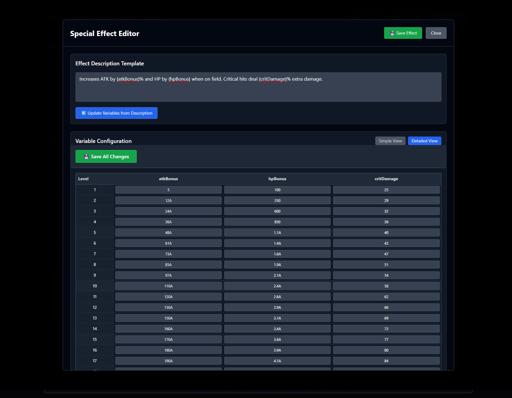

# Detailed View - Comprehensive Level Table

The Detailed View provides precision control over every single level from 1-200, allowing for fine-tuning and exact customization of special effect progressions. This is where you go when you need surgical precision in your effect design.

## 🎯 Overview

The Detailed View offers complete control:
- **Full 200-Level Table**: Every level from 1-200 is visible and editable
- **Multi-Variable Columns**: All effect variables displayed side-by-side
- **Sticky Save Button**: Always accessible while scrolling
- **Real-Time Updates**: Changes reflect immediately in preview



## 📋 Table Structure

### Layout Design
- **Rows**: Levels 1-200 (each row = one card level)
- **Columns**: One column per effect variable
- **Sticky Elements**: Level column and save button stay visible while scrolling
- **Visual Aids**: Alternating row colors every 5 and 10 levels

### Navigation Features
- **Sticky Level Column**: Always shows which level you're editing
- **Sticky Save Button**: Accessible at all times during editing
- **Smooth Scrolling**: Navigate through 200 levels efficiently
- **Visual Indicators**: Every 10th level highlighted for easy reference

## ✏️ Editing Capabilities

### Individual Cell Editing
Every cell in the table is a `LargeNumberInput` field:
- **Click to Edit**: Click any cell to start editing
- **Large Number Support**: Full game format support
- **Real-Time Validation**: Invalid formats highlighted immediately
- **Tab Navigation**: Use Tab key to move between cells

### Bulk Operations
While each cell is individually editable, you can:
- **Copy Values**: Use Ctrl+C/Ctrl+V for bulk operations
- **Pattern Recognition**: Manually create custom curves
- **Precise Adjustments**: Fine-tune specific level ranges

## 🔢 Large Number Integration

### Input Formats
All the same formats supported as Simple View:
```
Regular Numbers:    100, 1500, 750000
Decimal Numbers:    1.5, 2.75, 0.25
Game Notation:      1A, 2.5B, 100C
Scientific:         1e6, 2.5e9, 1e12
```

### Display Behavior
- **Focus State**: Shows raw input for editing
- **Blur State**: Displays formatted game notation
- **Validation**: Real-time error highlighting
- **Auto-Format**: Numbers converted to game format on save

## 💾 Save Functionality

### Sticky Save Button
The save button remains visible at all times:
- **Always Accessible**: Positioned at top of scrollable area
- **Immediate Save**: Changes saved instantly to memory
- **No Data Loss**: All edits preserved during navigation
- **Visual Feedback**: Button state indicates save status

### Data Persistence
- **Auto-Persistence**: Values maintained when switching views
- **No Regeneration**: Manual edits never overwritten automatically
- **Complete Control**: Only you decide when to change values

## 🎨 Use Cases

### Fine-Tuning After Interpolation
Perfect workflow after using Simple View:
1. Start in Simple View, set key levels, interpolate
2. Switch to Detailed View to see full progression
3. Fine-tune specific levels that need adjustment
4. Perfect the curve for game balance

### Custom Curve Design
Create unique progressions impossible with interpolation:
- **Step Functions**: Sudden jumps at specific levels
- **Plateaus**: Flat sections for balance reasons
- **Custom Spikes**: Power increases at arbitrary levels
- **Asymptotic Curves**: Approach limits gradually

### Precision Balance Testing
- **A/B Testing**: Compare specific level ranges
- **Granular Control**: Adjust individual problematic levels
- **Edge Case Handling**: Perfect values at level boundaries
- **Competition Balance**: Fine-tune for specific level brackets

## 📊 Table Features

### Visual Design
- **Compact Display**: Maximum data visible at once
- **Clear Headers**: Variable names always visible
- **Level Markers**: Every 5th and 10th row highlighted
- **Responsive Layout**: Adapts to different screen sizes

### Keyboard Navigation
- **Tab Order**: Natural left-to-right, top-to-bottom flow
- **Arrow Keys**: Navigate between cells efficiently
- **Enter Key**: Move to next row, same column
- **Escape Key**: Cancel current edit, revert changes

## ⚡ Performance

### Optimization Features
- **Efficient Rendering**: Only visible rows rendered
- **Lazy Loading**: Smooth scrolling through 200+ rows
- **Real-Time Updates**: Instant feedback on changes
- **Memory Efficient**: Handles large datasets smoothly

### Recommended Usage
- **Batch Edits**: Make related changes together
- **Save Frequently**: Use sticky save button regularly
- **Preview Often**: Check effect preview during editing
- **Test Ranges**: Focus on specific level brackets

## 🔗 Integration with Simple View

### Seamless Switching
- **Preserved Data**: All values maintained when switching views
- **Consistent Interface**: Same large number format support
- **Shared Preview**: Effect preview updates in real-time
- **No Data Loss**: Switch freely without losing work

### Complementary Workflow
1. **Rough Design**: Use Simple View for initial setup
2. **Fine-Tuning**: Switch to Detailed View for precision
3. **Quick Changes**: Return to Simple View for major adjustments
4. **Final Polish**: Back to Detailed View for perfection

## 💡 Pro Tips

### Efficient Editing
- **Focus on Problem Areas**: Don't edit every cell unnecessarily
- **Use Patterns**: Look for mathematical relationships
- **Test Key Ranges**: Focus on levels players actually reach
- **Consider Breakpoints**: Pay attention to limit break levels

### Balance Considerations
- **Player Experience**: Smooth progressions feel better
- **Power Spikes**: Use sparingly for excitement
- **Late Game**: Ensure high levels remain meaningful
- **Early Game**: Don't overwhelm new players

### Technical Tips
- **Large Numbers**: Use game notation for readability
- **Precision**: Don't over-engineer decimal places
- **Performance**: Very large numbers (>1e15) maintain full precision
- **Validation**: Red highlighting indicates format errors

## 🔗 Navigation

- [← Simple View Guide](./simple-view.md)
- [← Back to Overview](./README.md)
- [Large Number System](../technical/large-numbers.md)
- [Technical Reference](../technical/README.md)

The Detailed View gives you complete control over every aspect of your special effects, enabling the creation of perfectly balanced and precisely tuned effects that enhance the player experience at every level!