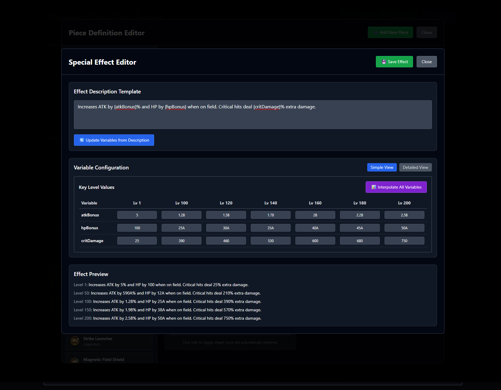

# Simple View - Key Level Interpolation

The Simple View provides an intuitive interface for quickly setting up special effects with smooth progressions across all memory card levels. It focuses on key levels where balance changes typically occur, allowing for rapid iteration and testing.

## 🎯 Overview

The Simple View is designed for efficiency and ease of use:
- **Key Level Focus**: Edit values at 7 critical levels (1, 100, 120, 140, 160, 180, 200)
- **Single Table Interface**: All variables displayed in one compact table
- **One-Click Interpolation**: Generate all 200 levels with a single button
- **Large Number Support**: Full game format (1A, 2.5B, etc.)



## 📊 Key Level System

### Why These Levels?
The key levels correspond to important progression milestones in Darkstar Idle:
- **Level 1**: Base effect strength
- **Level 100**: First major milestone
- **Level 120, 140, 160, 180**: Limit break levels
- **Level 200**: Maximum card level

### Variable Table Layout
Each row represents one effect variable:
- **Variable Name**: Extracted from effect description
- **7 Key Level Columns**: Editable input fields
- **Large Number Support**: Enter values like `5`, `1.2B`, `50A`

## 🔄 Interpolation Process

### How It Works
1. **Set Key Values**: Enter desired values at the 7 key levels
2. **Click "Interpolate All Variables"**: System generates smooth curves
3. **Piecewise Linear Interpolation**: Creates natural progressions between points
4. **Full Table Generation**: Calculates all 200 levels automatically

### Example Progression
```
atkBonus Variable:
Level 1:   5        (base value)
Level 50:  590A     (interpolated)
Level 100: 1.2B     (key level)
Level 150: 1.9B     (interpolated)
Level 200: 2.5B     (target value)
```

## ✨ Key Features

### Multi-Variable Support
- Handle multiple effect variables simultaneously
- Each variable can have different progression curves
- Independent scaling for different effect types

### Large Number Format
**Supported Formats:**
- **Integers**: `100`, `5000`, `750`
- **Decimals**: `1.5`, `2.75`, `0.5`
- **Game Notation**: `1A` (1,000), `2.5B` (2,500,000,000), `50C` (50,000,000,000,000)

**Display Examples:**
- Input: `2500000000` → Display: `2.5B`
- Input: `50000` → Display: `50A`
- Input: `750` → Display: `750`

### Real-Time Preview
The Effect Preview section shows exactly how your effect will appear in-game:
- **Multiple Levels**: Preview at levels 1, 50, 100, 150, 200
- **Formatted Values**: Numbers displayed in game format
- **Complete Description**: Full effect text with variable substitution

## 🎮 Workflow Examples

### Example 1: Damage Effect
```
Description: "Increases ATK by {atkBonus}% when on field"

Key Values:
Level 1:   5%
Level 100: 1.2B%
Level 200: 2.5B%

Result: Smooth exponential growth curve
```

### Example 2: Multi-Variable Effect
```
Description: "Increases ATK by {atkBonus}% and HP by {hpBonus} when on field. Critical hits deal {critDamage}% extra damage."

atkBonus:   5 → 2.5B (exponential growth)
hpBonus:    100 → 50A (moderate growth)
critDamage: 25 → 750 (linear growth)
```

## 💡 Best Practices

### Progression Design
1. **Start Conservative**: Begin with low level 1 values
2. **Plan End Game**: Set level 200 values for late-game balance
3. **Use Limit Breaks**: Leverage levels 120, 140, 160, 180 for power spikes
4. **Test Different Curves**: Experiment with linear vs exponential growth

### Large Number Usage
- Use game notation for readability (`1.5B` vs `1500000000`)
- Keep decimals reasonable (2-3 digits max)
- Consider display space in UI

### Variable Naming
- Use descriptive names: `atkBonus`, `hpMultiplier`, `critChance`
- Avoid spaces and special characters
- Keep names concise but clear

## 🔗 Navigation

- [← Back to Overview](./README.md)
- [Detailed View Guide →](./detailed-view.md)
- [Large Number System](../technical/large-numbers.md)
- [Effect Variables Reference](../technical/special-effects.md)

## 📈 Advanced Tips

### Balanced Progressions
- Use exponential curves for damage/stats
- Use linear curves for percentages/rates
- Consider diminishing returns for very high levels

### Performance Considerations
- Interpolation is instant for reasonable value ranges
- Large numbers are handled efficiently
- All 200 levels calculated in milliseconds

The Simple View makes it easy to create professional-quality special effects with minimal input, providing smooth, balanced progressions that feel natural in the game!